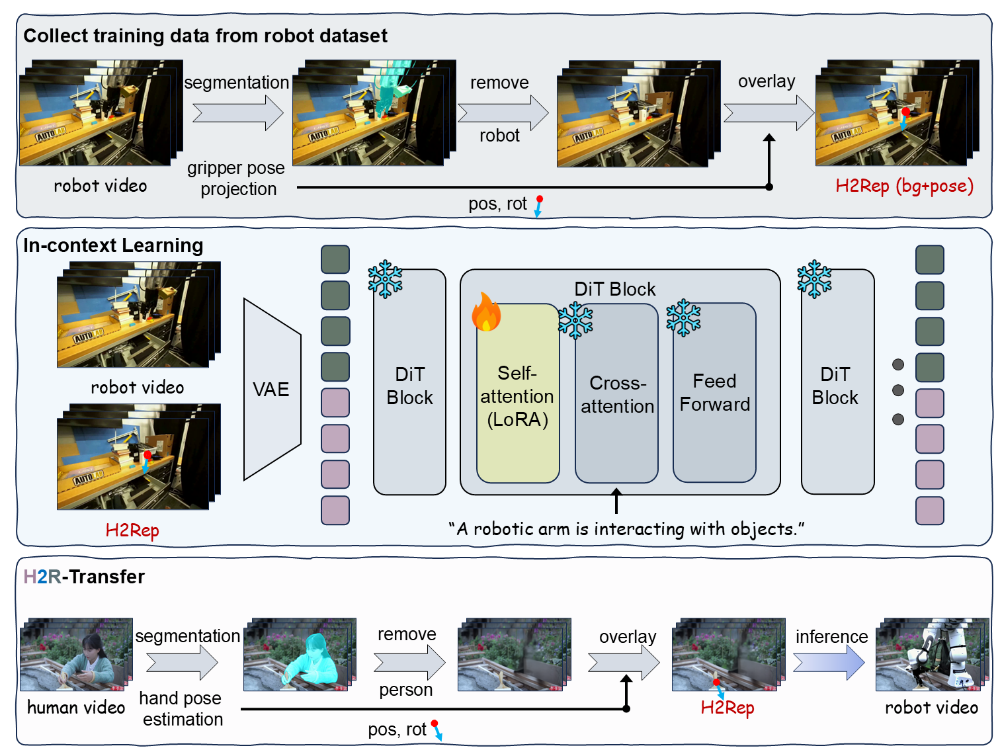

# **H2R-Grounder: A Paired-Data-Free Paradigm for Translating Human Interaction Videos into Physically Grounded Robot Videos**

**[Hai Ci](https://scholar.google.com/citations?user=GMrjppAAAAAJ&hl=en), [Xiaokang Liu](https://scholar.google.com/citations?hl=en&user=dAEHm8AAAAAJ), [Pei Yang](https://scholar.google.com/citations?hl=en&user=eBvav_0AAAAJ), [Yiren Song](https://scholar.google.com/citations?hl=en&user=L2YS0jgAAAAJ), [Mike Zheng Shou](https://scholar.google.com/citations?hl=en&user=h1-3lSoAAAAJ)***  
**Show Lab, National University of Singapore**  
*Corresponding author

📄 **Paper (arXiv):** [https://arxiv.org/abs/2512.09406](https://arxiv.org/abs/2512.09406)  
🌐 **Project Page:** [https://showlab.github.io/H2R-Grounder/](https://showlab.github.io/H2R-Grounder/)

---

## ⚡ TL;DR

**H2R-Grounder converts third-person human interaction videos into frame-aligned robot manipulation videos — using *no paired human–robot data* for training.**

---

## 📷 Method Overview

<p align="center">
  
</p>

**Figure: H2R-Grounder pipeline.**
We extract pose and background to form H2Rep, then use a diffusion-based in-context model to generate physically grounded robot videos aligned with human actions.

---

## 🎥 Qualitative Results

Visit our project page for **full videos**, comparisons, ablations, and failure case analysis:

👉 [https://showlab.github.io/H2R-Grounder/](https://showlab.github.io/H2R-Grounder/)

---

## 📦 Code & Models

Code and models will be released soon.

---

## ✏️ Citation

```bibtex
@article{ci2025h2rgrounder,
  title={H2R-Grounder: A Paired-Data-Free Paradigm for Translating Human Interaction Videos into Physically Grounded Robot Videos},
  author={Ci, Hai and Liu, Xiaokang and Yang, Pei and Song, Yiren and Shou, Mike Zheng},
  journal={arXiv preprint arXiv:2512.09406},
  year={2025}
}
```
